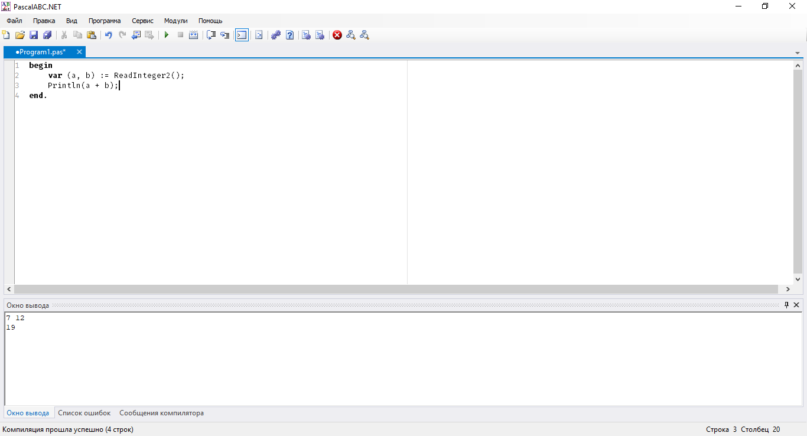

# PascalABC.NET
Modern Pascal for all. Supports Windows & Linux & macOS, .NET Framework & Mono, Console Applications & 2D & 3D, Windows Forms & WPF & Avalonia.

## Modern PascalABC.NET
This project has started since there was no real progress in the original PascalABC.NET tooling and IDE. Since then, following things have been done:
* Upgrade to modern .NET SDK project system (Microsoft.NET.Sdk)
* Upgrade NRefactory to latest 4.x version
* Build the majority 3rd-party non-UI libraries from source
* Drop net40, use net461 and net471
* Upgrade visual outlook of the IDE
* Upgrade all 3rd-party libraries to their latest versions (Mono.Cecil, DockPanelSuite, Microsoft.Build, DLR)

## Building
PascalABC is being developed in Visual Studio Community 2017. Use IDE or MSBuild command line to build PascalABC.NET solution. Do not forget to add `/restore` command line key to MSBuild.

Use any modern (5.4+) Mono (http://www.mono-project.com/docs/getting-started/install/linux/) MSBuild (not xbuild) to build PascalABC.NET on non-Windows platforms.

## Architecture
* IDE (PascalABCNET.exe, Windows-only)
* Console compiler (pabcnetc.exe)
* Runtime Library (Lib/* folder)
* SharpDevelop libraries (ICSharpCode.* dlls)
* Internal facilities (CodeCompletion, Compiler, CompilerTools, Debugger.Core, Errors, Localization, NETGenerator, OptimizerConversion, ParserTools, PascalABCParser, PluginsSupport, SemanticTree, SyntaxTree, SyntaxTreeConverters, SyntaxVisitors, TreeConverter, VBNETParser, YieldHelpers)
* Plugins (CompilerController, HelpBuilder, InternalErrorReport, LanguageConverter, SemanticTreeVisualisator, SyntaxTreeVisualisator, TestPlugin)
* PT4 taskbook (PT4Provider, PT4Tools, PT4/* folder)
* 3rd-party libraries (DockPanelSuite, DLR, Microsoft.Build, Mono.Cecil, SharpDisasm)

## Tests
Tests are located in the directory "TestSuite". To run the tests execute the file bin/TestRunner.exe